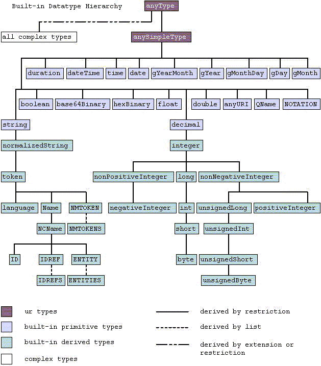

# xsd2src

## XSD

> This is a work-in-progress tool.\
> **Any part may be subject to change!**

### Schema structures and types

[Understanding W3C Schema Complex Types](https://www.xml.com/pub/a/2001/08/22/easyschema.html)

[XML Schema Tutorial](https://www.w3schools.com/xml/schema_intro.asp)

### Theory

The following table describes the supported structure variation:

| Class                       | `tle` | `non-tle` |
| --------------------------- | ----- | --------- |
| `NodeHandleComplexContent`  |       |           |
| `NodeHandleRestriction`     |       |           |
| `NodeHandleIndicator`       |       |           |
| `NodeHandleExtension`       |       |           |
| `NodeHandleComplexType`     |       |           |
| `NodeHandleAttribute`       |       |           |
| `NodeHandleGroup`           |       |           |
| `NodeHandleAttributeGroup`  |       |           |
| `NodeHandleSimpleContent`   |       |           |
| `NodeHandleChain`           |       |           |
| `NodeHandleSchema`          |       |           |
| `NodeHandleElement`         |       |           |
| `NodeHandleSimpleType`      |       |           |

* `tle` = top level element

## License

It's MIT.
